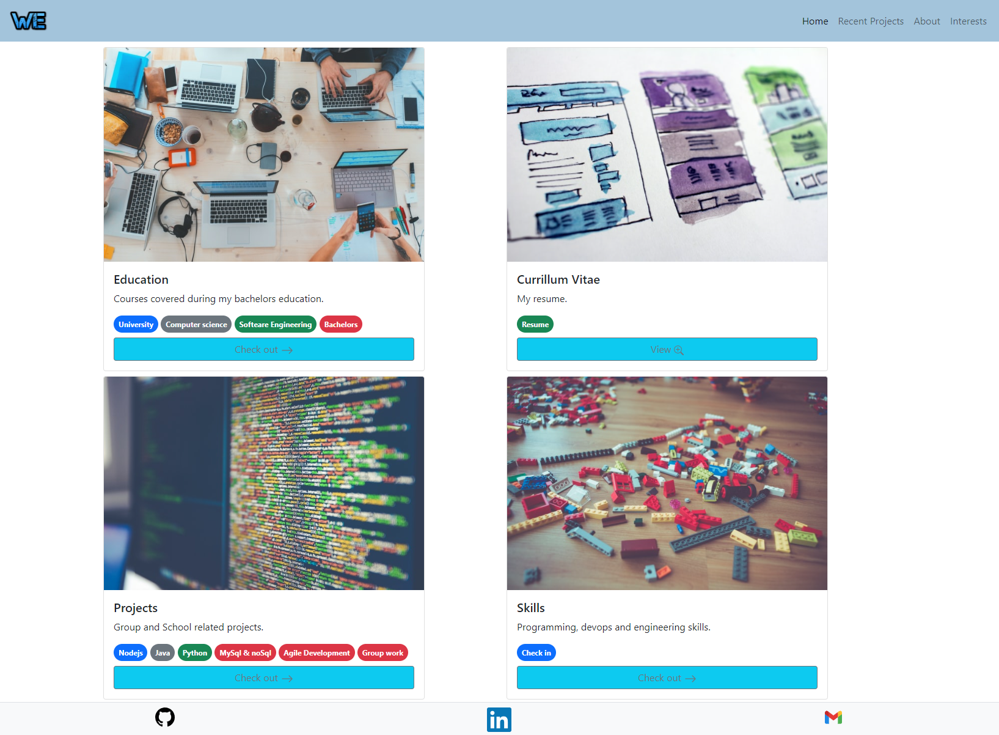
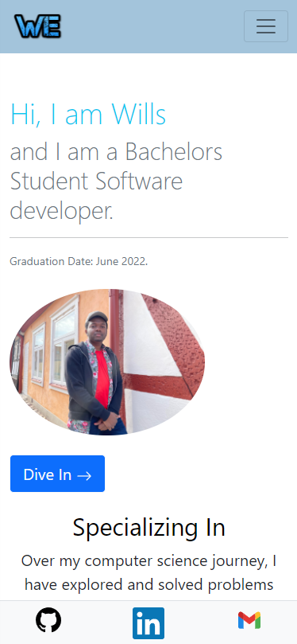

# Web base personal Curriculum vitae

# Endpoints

> '/' is severed using express.static() while for other endpoints, their corresponding files are sent over the corresponding request's response.

| Enpoint      | File servered                                                                                                                                 | Webpage title |
| ------------ | --------------------------------------------------------------------------------------------------------------------------------------------- | ------------- |
| '/'          | [/frontend/public/index.html](https://github.com/Willz01/portfolio/blob/main/frontend/public/index.html "index.html")                         | Deck          |
| '/home'      | [/frontend/public/views/home.html](https://github.com/Willz01/portfolio/blob/main/frontend/public/views/home.html "home.html")                | Home          |
| '/skils'     | [/frontend/public/views/skills.html](https://github.com/Willz01/portfolio/blob/main/frontend/public/views/skills.html "skills.html")          | Skills        |
| '/education' | [/frontend/public/views/education.html](https://github.com/Willz01/portfolio/blob/main/frontend/public/views/education.html "education.html") | Education     |
| '/about'     | [/frontend/public/views/about.html](https://github.com/Willz01/portfolio/blob/main/frontend/public/views/about.html "about.html")             | About         |
| '/projects'  | [/frontend/public/views/projects.html](https://github.com/Willz01/portfolio/blob/main/frontend/public/views/projects.html "projects.html")    | Projects      |
| '/interests' | [/frontend/public/views/interests.html](https://github.com/Willz01/portfolio/blob/main/frontend/public/views/interests.html "interests.html") | Interest      |

# Sneak pics
[Launching soon, need rest now!](https://wills-ekanem.xyz "MY WEBSITE")
### DECK SCRREN --desktop

### HOME SCRREN --desktop

### DECK SCRREN --mobile

### HOME SCRREN --mobile

